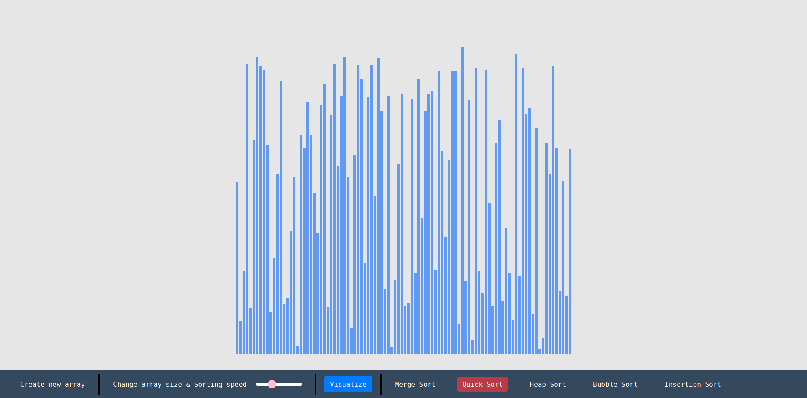

# Sorting Algorithms Visualizer

This project was bootstrapped with [Create React App](https://github.com/facebook/create-react-app).
I created this project for making this algorithms east to understand by visualizing the process. I
got the inspiration for this project from Clément Mihailescu.

### Requirements
1. `nodejs`
2. `npm`

### How to run ?
1. `git clone https://github.com/bpagare6/Sorting-Visualizer.git`
2. `npm install`
3. `npm start`

Currently this project supports only desktop mode and not optimized/designed for mobile phones.
If you would like to contribute to this project and build it for mobile, please send the pull
request :)

If you find any issues running this project please post it in issues!